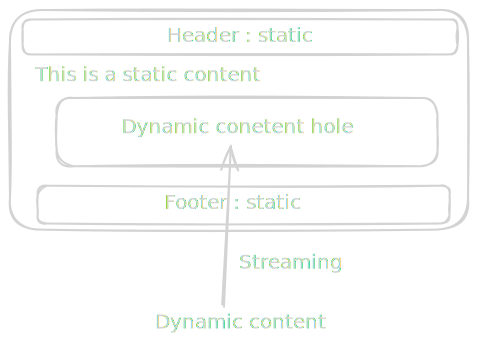

> Understand these rendering strategies and you'll understand what frameworks hide behind the abstraction.

You must have heard about **Static Site**, **Dynamic Site**, **SSG**, **ISR**, **SSR**, **CSR** and **PPR**, and you may have used frameworks like Next.js, Tanstack Start, Vite React or Astro. But are you using these frameworks just to write JSX because you know React, or do you want to understand which strategy to use exactly when? Then this article is exactly for you.


In this article we will explore and understand each of the rendering strategies in detail and in practice, using **Next.js**.
Why Next.js? Because modern Next.js supports all these rendering strategies, which you will soon find out.


## Why does understanding rendering strategies even matter?

Well, if you are thinking why you should even understand rendering strategies — you already use Next.js, why bother spending time here — then let me give you some solid reasons:

- Next.js or Tanstack Start are not just React. Writing JSX is not enough to utilise the full capacity of these frameworks.
- You know that if you are using `useState()` you put `"use client"` on top, but you don't really understand what Client and Server components are and why they matter. ([I cover exactly this in a separate article.](https://www.sandeepnayal.com/blogs/server-and-client-component))
- Rendering strategies decide performance, SEO, the Hydration errors you hate in Next.js, server resource consumption, caching, TTFB, etc.
- Understanding rendering strategies helps you divide your application routes into a proper flow — improving both build time and performance.
- Understanding rendering strategies helps you choose the right framework for the right kind of work.

I hope these reasons are enough to encourage you to understand these strategies.

## What are rendering strategies?

Rendering strategies decide **when and where HTML will be produced**, which is a crucial factor for an application's performance.
So now let's understand each strategy in detail and in practice. I encourage you to set up a Next.js application and follow the instructions. It will help you see things in action.


## Static Site

Open your terminal and run these commands -

```bash
mkdir static-demo && cd static-demo
cat > index.html <<'EOF'
<!doctype html>
<title>Static demo</title>
<h1>Hello — I was written before you asked for me.</h1>
<p id="t">no JS ran yet</p>
<script>document.getElementById('t').textContent = 'JS ran at ' + new Date().toISOString()</script>
EOF
python3 -m http.server 8000   # or: bunx serve
```

Then run these three tests against http://localhost:8000 — each one proves a property of static rendering:

- `curl http://localhost:8000` → you get the complete HTML back. The `<h1>` text is in the response. The server computed nothing — it handed you the file. This is the defining test.
- View source in the browser (Ctrl/Cmd+U) → it matches your file exactly. Compare it with "inspect element" (the live DOM) — the only difference is the `<p>` text, which JS changed after paint. That gap between "source" and "DOM" is your window into client-side work, and it'll grow as we move toward CSR.
- Open DevTools → Network, reload → one HTML request, served fast, and crucially zero data/API requests to fill in content. The content arrived with the document.

In simple terms, a static site is a pre-built HTML file which a web server just serves whenever someone requests it. The same HTML file for everyone, no recomputation required, the same content for everyone — the web server acts purely as a file transfer in this case.

Static sites are the best — you write them once, they require no computation, they have great SEO and browsers cache them greatly.

### Benefits of a static site

- Superfast, as no server computation is required.
- Cache friendly — open your browser's inspect tools → go to the Network tab → under headers, notice the status code. Initially it would be `200`, and then for subsequent requests it would be `304`, which is the status code for cached data.
- Great SEO.
- Great to serve with a CDN (Content Delivery Network).
- Smooth performance, better Lighthouse results.

### Where a static site does not fit

By now you must have understood that on a static site, the content does not change. Once it's built, it's baked in unless you modify the code and build it again. It is good for many use cases like blog pages, About pages, or even landing pages — a purely informative website like the one you are reading this blog on.

But many real-world applications require dynamic data — data that keeps changing per user or keeps updating. For such applications a static website makes no sense.

### Final takeaway

Use a static site when content is static, isn't personalised per user, and doesn't change too often.

## SSG (Static Site Generation)

If you have understood static sites, you will understand SSG easily too. Because *SSG is exactly a static site*.
The only thing that changes is who writes the files. In a hand-authored static site, you type each HTML file yourself. In SSG, a build step writes them for you — it takes a few templates plus a data source (markdown files, a CMS, a database, an API response) and, at build time, loops over the data emitting one finished HTML file per page. A thousand blog posts become a thousand HTML files, produced by a loop that runs once, not typed by hand.

Let's see this in action -

- Create a route in your Next.js app - `app/ssg/page.tsx`
- Put in this code -
```tsx
export default async function Page() {
  const renderedAt = new Date().toISOString();
  return <main><h1>SSG</h1><p>Rendered at: {renderedAt}</p></main>;
}
```
- Run `npm/bun/pnpm run build` (choose your package manager — I prefer bun, it's really fast).
- Then run `bun run start`.
- Open the website in your browser and navigate to `/ssg`.
- You will see that the "Rendered at" is displaying the time when you built this app.
- Now open your inspect tools → Network → headers, and notice the status code.
- View the page source and you will see a plain HTML document.

If you have done this, by now you must have understood what SSG means. SSG == Static site. That's it.

I do not need to write the benefits and disadvantages of SSG, as they are the same as a static site.

## ISR (Incremental Static Regeneration)

If you have understood SSG, then ISR is just one small step ahead. Because *ISR is SSG that refreshes itself*.

Remember the problem with a static site and SSG? Once it's built, the content is baked in — to change it, you rebuild the whole site. That's fine for 10 pages, but imagine a blog with 10,000 posts where one post gets edited. Rebuilding all 10,000 pages just to update one is wasteful. And what about content that updates every hour, like a news homepage or a product price? You can't run a full build every hour.

ISR fixes exactly this. It still serves a pre-built static HTML file (so you keep all the speed and caching), but it tells Next.js: *"after a certain time, the next time someone visits, rebuild this one page in the background and replace the old one."* So the page stays static, but it quietly refreshes itself on a schedule — without a full rebuild and without you doing anything.

Let's see this in action -

- Create a route in your Next.js app - `app/isr/page.tsx`
- Put in this code -
```tsx
// Rebuild this page at most once every 10 seconds
export const revalidate = 10;

export default async function Page() {
  const renderedAt = new Date().toISOString();
  return <main><h1>ISR</h1><p>Rendered at: {renderedAt}</p></main>;
}
```
- Run `bun run build` and then `bun run start` (ISR only works in a production build, not in `dev`).
- Open `/isr` in your browser and note the "Rendered at" time.
- Refresh a few times within 10 seconds → the time does **not** change. You are being served the same pre-built file. This is the static part.
- Now wait more than 10 seconds and refresh once → you'll likely still see the **old** time. Refresh once more → now the time updates.

That last step confuses everyone the first time, so let me explain it. ISR is *stale-while-revalidate*. After the 10 seconds pass, the very next visitor still gets the old (stale) page instantly — Next.js does not make them wait. In the background, Next.js rebuilds the page. Once it's ready, the *next* visitor gets the fresh one. So nobody ever waits for a build, but the content is always at most ~10 seconds behind. That's the whole trick.

You can literally watch this happen -

- Open inspect → Network → click the `/isr` request → look at the response headers for `x-nextjs-cache`.
- `HIT` → served straight from the cache (fresh).
- `STALE` → you got the old page, and a rebuild just kicked off in the background.
- `MISS` → it wasn't cached, so it was built right now.

Refresh around your 10-second window and watch this header flip from `HIT` to `STALE` to `HIT` again. That single header tells you the entire story of ISR.

### Benefits of ISR

- Static speed — visitors get a pre-built file, served fast and cached, just like a static site.
- Content stays reasonably fresh without a full rebuild.
- Scales to huge sites — 10,000 pages don't need to be rebuilt to update one. You can even let pages be generated on-demand the first time they're requested (with `generateStaticParams`), instead of all at build time, which keeps your build fast.
- Nobody ever waits for a rebuild, because regeneration happens in the background.

### Where ISR does not fit

ISR is still static at heart — every visitor gets the **same** page until the next regeneration. So the two places it breaks down are:

- **Per-user content.** A dashboard, an account page, a cart — these are different for every user. ISR can't help, because it serves one shared cached page to everyone.
- **Truly real-time data.** Stock tickers, live scores, "3 seats left" — if the data must be correct on *every single request*, a page that's "at most 10 seconds stale" isn't good enough. For that you need SSR or client-side fetching, which we'll cover next.

A good rule of thumb: if you can answer *"a few seconds or minutes old is fine"*, ISR is perfect. If the answer is *"it must be exactly right, right now, for this specific user"*, ISR is the wrong tool.

### Final takeaway

Use ISR when content is shared across users (not personalised) but changes often enough that a full rebuild every time is impractical. It gives you static performance with content that keeps itself up to date.

## SSR (Server-Side Rendering)

So far every strategy gave everyone the **same** page. Static and SSG build it once, ISR rebuilds it on a timer — but it's still one shared file. The moment you need a page that is *different for each request* — personalised per user, or correct right now on every single visit — you need SSR.

SSR means the server builds the HTML **fresh, on every request**. Someone visits → the server runs your component *at that moment*, with that request's data (cookies, the logged-in user, search params, live database values) → it sends back finished HTML → the browser shows it instantly. No build-time freezing, no timer. Just: a request comes in, the page is rendered for it, then thrown away.

Notice the progression: SSG renders once at build time, ISR re-renders occasionally in the background, and SSR renders every time someone asks. That's the whole spectrum — *when* the HTML is produced moves from "long ago" to "right now".

Let's see this in action -

- Create a route in your Next.js app - `app/ssr/page.tsx`
- Put in this code -
```tsx
export default async function Page({
  searchParams,
}: {
  searchParams: Promise<{ name?: string }>;
}) {
  const { name } = await searchParams;
  const renderedAt = new Date().toISOString();
  return (
    <main>
      <h1>SSR</h1>
      <p>Hello, {name ?? "stranger"}!</p>
      <p>Rendered at: {renderedAt}</p>
    </main>
  );
}
```
- Run `bun run build` and then `bun run start`.
- Open `/ssr` in your browser.

Now run these tests — each one proves a property of SSR:

- Refresh the page a few times → the "Rendered at" time **changes on every refresh**. This is the defining test. Compare it with SSG (frozen at build time) and ISR (frozen until the timer). Here it's recomputed for every request.
- Visit `/ssr?name=Sandeep` → the page now says "Hello, Sandeep!". Same code, same file, but a different output for a different request. *That* is personalisation — and it's exactly what ISR and SSG could not do.
- View the page source (Ctrl/Cmd+U) → your name and the timestamp are already there, baked into the HTML. The server did the work, not the browser. So you keep great SEO and no blank-screen-then-pop-in, even though the page is fully dynamic. (Hold on to this — it's the exact opposite of CSR, which is next.)
- Look at the build output from `bun run build` → next to `/ssr` you'll see an `ƒ (Dynamic)` marker, while `/ssg` shows `○ (Static)`. Next.js is literally telling you which strategy each route uses.

Why did just reading `searchParams` turn this into SSR? Because `searchParams` is request-time data — it doesn't exist until a real request arrives. The moment your component reads something that only exists per request (search params, `cookies()`, `headers()`), Next.js has no choice but to render on the server, per request. You usually don't flip a switch to "turn on SSR" — you just read request data, and SSR is what you get. (If you ever need to force it explicitly, `export const dynamic = "force-dynamic"` does the job.)

### Benefits of SSR

- Always fresh — the data is correct as of this exact request, every time.
- Personalised — you can render per user, per cookie, per location, per anything in the request.
- Still SEO-friendly and fast to first paint — the HTML arrives complete, with content already in it (unlike CSR - Most loved by vite react developers).

### Where SSR does not fit

SSR is powerful, but it isn't free — and that's the catch:

- **It runs your code on every single request.** That means a live server doing work for each visitor — slower TTFB than a static file, more server resources, and a bigger bill under heavy traffic.
- **It's harder to cache on a CDN**, because the response is potentially different every time. You lose the "serve one file to a million people" superpower of static.

So if a page is the same for everyone and doesn't change every second, SSR is overkill — don't pay per-request rendering for content a static file (or ISR) could serve. Reach for SSR only when you genuinely need request-time freshness or per-user output.

### Final takeaway

Use SSR when the page must reflect per-request or per-user data and be correct at the exact moment it's requested — while still shipping complete, SEO-friendly HTML from the server. You trade some speed and server cost for freshness and personalisation.

## CSR (Client-Side Rendering)

CSR is the exact opposite of everything so far. Every strategy until now produced finished HTML *on the server* (at build time, on a timer, or per request) and sent it to the browser ready to display. CSR flips it- the server sends an almost **empty shell plus a JavaScript bundle**, and the browser does the rendering - it runs the JS, fetches the data, and builds the page right there on your browser.

This is the classic "single-page app" model - the way plain Vite + React works. The server barely does anything, the browser does all the work after the page loads.

Now here's a catch that trips up almost everyone in Next.js - marking a component `"use client"` does **not** opt you into CSR. A client component is still server-rendered on the first load and then *hydrated* in the browser - so the initial HTML you get back still contains the content. `"use client"` only means "this component also runs in the browser, so it can use state, effects and browser APIs" — it does not mean "this component is rendered only in the browser".

To get *true* CSR - server sends nothing, browser renders everything - you have to explicitly turn off server-rendering for the component. In Next.js you do that with a dynamic import and the `ssr: false` flag: `dynamic(() => import("./Component"), { ssr: false })`. Then you fetch your data in the browser (for example inside `useEffect`).

Remember way back in the Static Site section, that gap between "View Source" and the live DOM? This is where it becomes the whole story.

Let's see this in action -

- First, the component itself - `app/csr/Clock.tsx`
```tsx
"use client";

import { useState, useEffect } from "react";

export default function Clock() {
  const [renderedAt, setRenderedAt] = useState<string | null>(null);

  useEffect(() => {
    // This runs in the browser, AFTER the JS has loaded
    setRenderedAt(new Date().toISOString());
  }, []);

  return renderedAt ? <p>Rendered at: {renderedAt}</p> : <p>Loading...</p>;
}
```
- Now the page that loads it with SSR turned off - `app/csr/page.tsx`
```tsx
"use client";

import dynamic from "next/dynamic";

// ssr: false → the server renders nothing for <Clock />.
// The browser downloads the JS and renders it entirely on the client.
const Clock = dynamic(() => import("./Clock"), { ssr: false });

export default function Page() {
  return (
    <main>
      <h1>CSR</h1>
      <Clock />
    </main>
  );
}
```
- (Note: `ssr: false` is only allowed inside a Client Component, which is why this page also has `"use client"` on top.)
- Run `bun run build` and then `bun run start`.
- Open `/csr` in your browser.

Now run these tests — each one proves a property of CSR:

- Watch closely as the page loads → you'll see "Loading..." flash for a split second before the time appears. That flash is the browser rendering *after* the JavaScript runs. With SSR the content was there instantly. here it pops in.
- View the page source → you'll see the `<h1>CSR</h1>` heading, but **neither** the "Loading..." text nor the time — the whole `<Clock />` is missing from the HTML. Because we disabled SSR for it, the server rendered nothing for that component, it only comes into existence after the browser runs the JS. This is the defining test, and it's the exact opposite of SSR, where your name and timestamp were right there in the source.
- Disable JavaScript in DevTools and reload → only the heading shows, the clock never appears. **No JS means no content** (Try the same on the SSR page and it still shows its content — because that one was rendered on the server.)

Want proof that `"use client"` alone wasn't enough? Drop the `dynamic(..., { ssr: false })` wrapper and just render `<Clock />` directly in a plain `"use client"` page. View source again, and now you'll find "Loading..." sitting right there in the HTML — because the client component *was* server-rendered after all, then hydrated. That single `ssr: false` flag is the actual line between "runs in the browser too" and "rendered only in the browser".

### Why is CSR slow to load but fast once loaded?

This confuses people, so let's break CSR into the three phases of *when work happens* — the same lens we've used for every strategy:

- **Build time** → all that happens is your JavaScript gets bundled. No HTML content is produced.
- **Request time** → the server just hands over the static shell and that JS bundle. This is near-zero server work — the shell is literally a static file, the same one for everyone, perfect for a CDN.
- **Client time** → this is where everything actually happens, and it's a *chain* that must run in order: get the shell → download the JS → execute the JS → fetch the data → render.

That chain is exactly why the **first** load is slow. Nothing meaningful shows up until every link finishes — the browser can't render the content until it has fetched the data, can't fetch until the JS executes, can't execute until the JS downloads, can't download until the shell arrives. Each step waits for the one before it. That's the "Loading..." gap you saw.

But here's the flip side, and why CSR feels so *fast once loaded*: after that chain runs once, the JS app is already alive in the browser. Navigating to another page or updating data no longer needs a new HTML document from the server — the app just fetches a bit of data and updates the DOM in place. No full reload, no round trip for a page. So CSR pays a big cost **once**, upfront, and then feels snappy and instant for the rest of the session. SSR is the opposite: every navigation is a fresh server round trip, so it's fast to *first* paint but pays a smaller cost *repeatedly*.

### Benefits of CSR

- Rich, app-like interactivity - anything that depends on the browser (state, effects, event handlers, `localStorage`, `window`) lives here.
- Cheap to host and serve - the shell is just a static file you can throw on a CDN, and the server does no per-request rendering work.
- After the first load, navigation and updates can feel instant, because the app updates the DOM in place instead of fetching new HTML.

### Where CSR does not fit

CSR's weaknesses are the mirror image of its strengths:

- **Bad for SEO.** A crawler that looks at your source sees an empty shell, not your content. For public, content-driven pages this is a dealbreaker.
- **Slower first paint.** The user waits for the JS to download, run, and fetch data before they see anything — that "Loading..." gap. On a slow phone or network, it's worse.
- **The work moves to the user's device.** A cheap old phone now has to do the rendering your server used to do.

So CSR is a poor fit for blogs, marketing pages, or anything that needs to be indexed or load instantly. It shines for the opposite kind of page: highly interactive screens behind a login, where SEO doesn't matter and interactivity does — think dashboards, editors, chat apps, settings panels.

### Final takeaway

Use CSR for highly interactive, app-like UIs that live behind authentication and don't need SEO. You trade first-paint speed and search visibility for rich client-side interactivity and cheap hosting.

## PPR (Partial Prerendering)

Here's the question every strategy so far forced on you: *pick one*. Static gives you instant, cacheable HTML but it's frozen. SSR gives you fresh, per-request data but pays a server cost on every visit and a slower first byte. So what do you do with a real page — say a product page — where the **header, layout and product description never change**, but the **cart count and live price must be fresh per request**? With what we've learned so far, you'd have to make the *whole page* dynamic just because one corner of it is. The static 90% gets dragged down to the speed of the dynamic 10%.

PPR **refuses that trade-off** . It lets a **single page be partly static and partly dynamic at the same time**. The static parts are prerendered into a shell and sent instantly (like a static site), while the dynamic parts stream in a moment later (like SSR) — all in one response.

This is the payoff of the whole article - PPR is not a new idea, it's the **combination** of the ones you already understand. Static shell + streamed dynamic content. Look at how it works and you'll recognise every piece.

The mechanism is beautifully simple- anything you wrap in a React `<Suspense>` boundary becomes a "dynamic placeholder". At build time, Next.js prerenders everything *outside* the boundaries into the static shell, and drops the boundary's `fallback` into that shell as a placeholder. Then at request time, the real content inside each boundary is rendered and **streamed** in to replace the placeholder. The `<Suspense>` boundary is literally the line where "static shell" ends and "dynamic streaming" begins.



In modern Next.js, PPR is the **default behaviour once you enable Cache Components**. The old `experimental_ppr` flag is gone.

Let's see this in action -

- Enable Cache Components in your `next.config.ts` -
```ts
import type { NextConfig } from "next";

const nextConfig: NextConfig = {
  cacheComponents: true,
};

export default nextConfig;
```
- Create a route - `app/ppr/page.tsx`
- Put in this code -
```tsx
import { connection } from "next/server";
import { Suspense } from "react";

// The dynamic part — it defers to request time and streams in.
async function LiveTime() {
  await connection(); // "this needs a real request" — opts into dynamic
  const renderedAt = new Date().toISOString();
  return <p>Dynamic part, rendered at: {renderedAt}</p>;
}

export default function Page() {
  return (
    <main>
      {/* Static part — prerendered into the shell at build time */}
      <h1>PPR</h1>
      <p>Static part — baked into the shell, served instantly.</p>

      {/* Dynamic part — fallback ships in the shell, real content streams in */}
      <Suspense fallback={<p>Loading the dynamic part...</p>}>
        <LiveTime />
      </Suspense>
    </main>
  );
}
```
- Run `bun run build` and then `bun run start`.
- Open `/ppr` in your browser.

Now run these tests — each one shows the two halves living together:

- Watch the page load → the heading and the static paragraph appear **instantly**, with "Loading the dynamic part..." underneath. A split second later the timestamp streams in and replaces it. You just watched the shell arrive first and the dynamic hole fill in after.
- View the page source (Ctrl/Cmd+U) → you'll see the `<h1>`, the static paragraph, and the **fallback** ("Loading the dynamic part...") — but **not** the timestamp. That's the proof: the static shell *including the placeholder* is in the HTML, and the dynamic content is not — it arrives via streaming.
- Refresh a few times → the static parts are byte-for-byte identical and instant every time, while the timestamp changes on every request. Static and dynamic, side by side, in one page.

> **One honest catch worth knowing** — turning on `cacheComponents` changes the rules for your **whole app**, not just this route. The route-segment configs we used earlier — `export const revalidate` for ISR and `force-dynamic` for SSR — don't apply under Cache Components, and any component that reads request-time data without a `<Suspense>` (or a `use cache`) around it will throw a build error telling you to wrap it. So do this PPR experiment in a **separate project** from the earlier demos, otherwise they'll fight each other.

### Benefits of PPR

- The best of both worlds - static speed and instant first paint for most of the page, with fresh/personalised data where you actually need it.
- No all-or-nothing penalty - one dynamic corner no longer forces the entire page to be dynamic.
- Great perceived performance - the user sees a meaningful page immediately and never stares at a blank screen, because the shell is real content, not a spinner.
- It's mostly declarative — you don't configure rendering strategies, you just wrap the dynamic bits in `<Suspense>` and Next.js figures out the split.

### Where PPR does not fit

- If a page is **fully static**, PPR adds nothing - there are no dynamic holes to stream. Just let it be static.
- If a page is **dynamic top to bottom** (e.g. a fully personalised dashboard where *nothing* is shared), there's no meaningful static shell to send first, so you're effectively back to SSR.
- It needs the newer Cache Components model, so it's the most "bleeding edge" of these strategies — fine for new apps, more friction to retrofit into an old one.

### Final takeaway

Use PPR when a single page mixes mostly-static content with a few genuinely dynamic pieces - which, honestly, describes most real pages. Wrap the dynamic parts in `<Suspense>`, ship the static shell instantly, and let the rest stream in.

## Wrapping up

If you've followed along and run every demo, look at what you can now see *through* the framework:

| Strategy | When HTML is produced | Best for |
| --- | --- | --- |
| **Static / SSG** | Once, ahead of time at build | Fastest, cacheable, frozen content |
| **ISR** | SSG that rebuilds itself on a timer | Static speed, periodically fresh |
| **SSR** | Fresh on every request | Personalised, always-current (at a server cost) |
| **CSR** | In the browser, after JS loads | Rich interactivity, weak SEO, slow first paint but snappy after |
| **PPR** | Static shell at build + dynamic holes streamed per request | The combination of all the above |

Notice the single axis running through all of them: ***when and where the HTML is produced*** - build time, a timer, request time, or the browser. That's the entire idea we started with. Every framework - Next.js, Tanstack Start, Astro, whatever comes next - is just giving you switches over that one question.

So the next time you reach for `"use client"`, or wonder why your page is slow, or your data is stale, or Google can't see your content, you won't be guessing. You'll know exactly which strategy you're using, and which one you *should* be using. That's the **difference between writing JSX and actually understanding the framework.**

