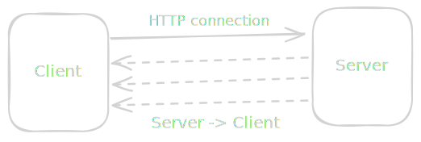
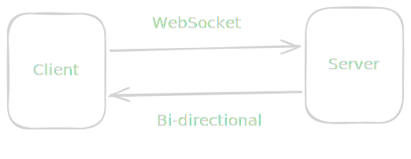

> Understand Server-Sent Events and you'll understand that "real time" on the web is mostly just an HTTP connection nobody closed.

You've probably seen it a hundred times — a live cricket score that ticks up on its own, a "user is typing…" bubble, a deployment log that streams into your browser line by line, an AI chat that types its answer word by word or a notification popping up. It feels like magic, like the server reached out and *pushed* something to you. So you reach for the thing everyone names first — **WebSockets** — assuming that's the only way to do real-time.

But most of the time you don't need WebSockets at all. You need something far simpler, something that's *already built into HTTP*: **Server-Sent Events**.

In this article we'll build up to SSE from first principles — what "real time" really means, what an HTTP request actually is, how SSE is just an HTTP connection that nobody closes, and how it differs from WebSockets. Then we'll build a working example end-to-end with **Express** and a plain **HTML** file, so you can watch it happen.

## Why does understanding SSE even matter?

If you're thinking *"I'll just grab Socket.IO and move on"* — here's why it's worth slowing down:

- Real-time is one of the most over-engineered parts of web apps. People reach for heavy bidirectional protocols when a one-way stream would do.
- SSE is just HTTP. That means it works with your existing systemc. No new protocol, no new mental model.
- It auto-reconnects itself. WebSockets make you build that yourself.
- Understanding SSE forces you to actually understand HTTP — what a request *is*, when a connection closes, and why "streaming" is just "not closing yet".
- Knowing the difference between SSE and WebSockets means you'll pick the right tool instead of defaulting to the heaviest one.

That last point is the whole game. So let's start where every real-time conversation should start — with what "real time" even means.

## What does "real time" really mean?

"Real time" sounds like a precise technical thing, but on the web it's mostly a feeling — *the screen updates without me asking*. The honest question is: **who initiates the update?**

Normally the browser does , You click, it requests, the server responds. Nothing appears on your screen unless *you* asked for it. That's the entire web — request, response, done. The server is a server: *It serves when you ask*

"Real time" is when the server starts serving you data without you asking!. And there are really only a few ways to do it:

- **Polling** — the browser asks "anything new?" every few seconds, over and over. Simple, but wasteful and always a little stale. It's you knocking on the door every 5 seconds asking "mail yet? mail yet?".
- **Long polling** — the browser asks "anything new?" and the server *holds the request open* until it actually has something, then answers. Better, but you re-ask after every single message.
- **Server-Sent Events** — the browser opens *one* connection and the server keeps sending messages down it whenever it wants. One knock, then the mail just keeps coming through the open door.
- **WebSockets** — the browser and server open a permanent two-way pipe and both can talk freely, anytime.

Notice the progression — it's the same axis the whole time: *how long do we keep the connection open, and who's allowed to talk over it?* Polling keeps nothing open. Long polling keeps it open for one message. SSE keeps it open forever, **one direction**. WebSockets keep it open forever, **both directions**.

Almost every "real-time" feature you've ever seen is one of these four. And to understand the middle two, you have to understand the thing they're built on — plain HTTP.

## What is HTTP, really?

Your browser opens a **TCP connection** to a server (basically a phone line), sends some text down it, the server sends some text back, and then — this is the important part — **the connection closes**.

Let's actually see it. Open a terminal:

```bash
curl -v http://example.com
```

Look at the `-v` (verbose) output and you'll see the whole conversation:

- `> GET / HTTP/1.1` — your browser saying "give me this page".
- `> Host: example.com` and a few more `>` lines — the request headers.
- `< HTTP/1.1 200 OK` — the server answering.
- `< Content-Length: 1256` — the server saying "my answer is exactly 1256 bytes long".
- then the HTML body, and the connection closes.

That `Content-Length` line is the key to *everything* that follows. The server is promising up front: *"here is exactly how much I'm going to say, and once I've said it, I'm done — goodbye."* The browser reads exactly that many bytes, sees the connection close, and considers the request finished.

So the default shape of HTTP is: **open → ask → get a complete answer → close.** One request, one response, connection gone. This is why HTTP feels like it *can't* do real-time — the server has no way to speak again after it hangs up.

But what if the server simply… didn't promise a length? What if it never hung up?

## SSE is just an HTTP connection that stays open

Here's the entire trick behind Server-Sent Events, and it's almost anticlimactic.

Instead of saying `Content-Length: 1256` ("I'll say exactly this much, then leave"), the server says:

```http
Content-Type: text/event-stream
```

This is the server telling the browser: *"I'm **not** going to tell you how long my answer is. I'm going to keep this connection open and dribble text down it whenever I feel like it. Don't hang up. Keep listening."*

That's it. **SSE is a normal HTTP request where the response never ends.** The browser made one ordinary GET request, and the server just… keeps writing to it. Every time the server writes a chunk, the browser receives it instantly as an **event**. No new request, no new protocol — the same TCP phone line from the last section, just one where nobody says goodbye.



The format the server writes is very simple too. Each message is just text, with a `data:` prefix and a **blank line** to mark the end of the message:

```text
data: hello

data: it is now 10:42

data: {"price": 42000}

```

That's the whole SSE protocol. `data:` then your text, then a blank line. Send it once, send it a thousand times — the browser fires an event for each one. You can optionally add an `event:` line to name the event type and an `id:` line so reconnection can resume, but at its core it is *just text down an open pipe*.

And here's the part that makes SSE lovely to work with — because it's plain HTTP, the browser gives you a built-in client for it called `EventSource`, and that client **automatically reconnects** if the connection drops. You write almost nothing.

Let's see all of this in action — but first, the one comparison everyone asks for.

## What about WebSockets? How is SSE different?

WebSockets get mentioned in the same breath as SSE, so let's be precise about how they differ — because the difference is simple and it decides which one you should use.

A WebSocket starts life as an HTTP request too, but then it does something SSE never does: it **upgrades**. The browser sends a request with `Upgrade: websocket`, and if the server agrees, both sides *abandon HTTP* and switch to a different, two-way protocol over the same connection. From that point on it's not request/response anymore — it's a permanent open pipe where **both** the browser and the server can send messages, anytime, in any order.



That's the one real difference, and everything else follows from it:

| | **SSE** | **WebSockets** |
| --- | --- | --- |
| **Direction** | One-way: server → browser only | Two-way: both can send, anytime |
| **Protocol** | Plain HTTP (just a long response) | A separate protocol after an HTTP upgrade |
| **Data** | Text only (UTF-8) | Text *and* binary |
| **Reconnect** | Automatic, built into `EventSource` | You build it yourself |
| **Auth / proxies / middleware** | Works with all your normal HTTP stuff | Often needs special handling |
| **Browser client** | Built-in `EventSource` | Built-in `WebSocket`, but more to manage |

The decision rule is genuinely this short:

- Does the data only flow **from server to browser**? → **SSE.** Live scores, notifications, deploy logs, progress bars, stock tickers, an AI streaming its answer token by token. The browser never needs to talk back over the same channel — and if it does occasionally (like sending a chat message), it can just make a *normal* separate HTTP POST.
- Do **both sides** need to send messages constantly, with low latency, in both directions? → **WebSockets.** Multiplayer games, collaborative editors (think two cursors moving in the same doc), live audio/video signalling, a chat where typing indicators fly both ways every keystroke.

Most "real-time" features are actually one-directional. The server has news; the browser just wants to hear it. That's SSE's entire home turf — and people reach past it for WebSockets far more often than they should.

Enough theory. Let's build one.

## A simple SSE implementation in Express

We'll build the smallest possible real-time app: a server that streams the current time to the browser every second, and a plain HTML page that displays it. No frameworks, no libraries beyond Express.

First, set up the project:

```bash
mkdir sse-demo && cd sse-demo
npm init -y
npm install express
```

Now create `server.js`:

```js
const express = require("express");
const app = express();

// Serve our HTML file
app.use(express.static("public"));

app.get("/events", (req, res) => {
  // The important  headers — "this response never ends"
  res.setHeader("Content-Type", "text/event-stream");
  res.setHeader("Cache-Control", "no-cache"); // Tell browser not to cache the last response
  res.setHeader("Connection", "keep-alive");
  res.flushHeaders(); // send the headers right now, don't wait

  // Send an event every second by just writing to the open response
  const interval = setInterval(() => {
    const now = new Date().toISOString();
    // res.write - because the data format is simple text called wire format
    res.write(`data: ${now}\n\n`); // "data:" + text + blank line
  }, 1000);

  //  When the browser disconnects, stop sending
  req.on("close", () => {
    clearInterval(interval);
  });
});

app.listen(3000, () => console.log("http://localhost:3000"));
```

Read that and notice how little is happening. There's no special "SSE library". The entire technique is three things:

- **The headers.** `Content-Type: text/event-stream` is what turns an ordinary response into a stream. We never call `res.end()`, so the response stays open — exactly the "no `Content-Length`, never hang up" idea from earlier.
- **`res.write(...)`.** This is the whole event-sending mechanism. Every time we write `data: ...\n\n` to the still-open response, the browser receives one event. We're literally just dribbling text down the pipe, on our schedule, not the browser's.
- **The cleanup.** `req.on("close", ...)` fires when the browser disconnects. Without it, our `setInterval` would keep ticking forever for a connection nobody is listening to — a classic real-time memory leak.

That's the entire server. Now the page that listens to it.

## A simple HTML page that consumes the stream

Create `public/index.html`:

```html
<!doctype html>
<title>SSE demo</title>
<h1>Live server time</h1>
<p id="time">connecting…</p>

<script>
  // EventSource = the browser's built-in SSE client
  const source = new EventSource("/events"); // "/evenst" ->Your API end point

  // Fires once per "data:" message the server writes
  source.onmessage = (event) => {
    document.getElementById("time").textContent = event.data;
  };

  source.onerror = () => {
    // No retry logic needed — EventSource reconnects automatically
    console.log("connection dropped, EventSource will retry…");
  };
</script>
```

Run it:

```bash
node server.js
```

Open `http://localhost:3000` and the time updates every second, all on its own. Now run these tests — each one proves a property of SSE:

- **Watch the time tick.** The browser made exactly *one* request to `/events` and the time keeps updating. You never wrote a loop in the browser, never polled, never re-requested. The server is doing the talking. This is the defining test.
- **Open DevTools → Network → click the `/events` request.** Look at the **Type** column — it says `eventsource`. Look at the request: it's a perfectly ordinary `GET`, status `200`, but it never "finishes" — it stays in a pending/streaming state, and under its **EventStream** / **Response** tab you can watch each `data:` message arrive in real time. That pending-forever request *is* SSE.
- **`curl http://localhost:3000/events`.** This is the best test of all. You'll see `data:` lines printing to your terminal, one per second, and `curl` just *hangs there* receiving them, because the response never ends. No browser, no JavaScript — proof that SSE is nothing but a long HTTP response. Hit Ctrl+C to hang up (and watch your server's `req.on("close")` fire).
- **Kill the server (Ctrl+C) and restart it.** Watch the browser — within a couple of seconds it reconnects and the time resumes, completely on its own. You wrote *zero* reconnection code. That's `EventSource` doing the work WebSockets would have made you build by hand.

That last test is the one to sit with. Compare it to what a WebSocket would require: detecting the drop, backing off, re-opening the socket, re-establishing state. Here it's free, because SSE never stopped being HTTP.

## A few other things worth knowing

Once you've got the basics working, a handful of real-world details come up fast:

- **Named events.** Beyond plain `data:`, you can label messages with an `event:` line — `event: priceUpdate\ndata: 42000\n\n` — and listen with `source.addEventListener("priceUpdate", ...)`. Handy when one stream carries several kinds of updates.
- **Resuming with `id:`.** If you send an `id:` with each message, the browser remembers the last one it saw and, on reconnect, sends it back in a `Last-Event-ID` header. Your server can read that and replay anything the client missed during the drop — built-in, no extra protocol.
- **The 6-connection limit (the classic gotcha).** Over plain HTTP/1.1, browsers allow only ~6 simultaneous connections *per domain*. Since each SSE stream holds one open, six tabs can exhaust it. The fix is simply **HTTP/2** (or HTTP/3), which multiplexes many streams over one connection and makes the limit disappear — another reason "SSE is just HTTP" pays off.
- **Proxies that buffer.** Some reverse proxies (nginx, for instance) buffer responses by default and will hold your events instead of forwarding them, making the stream feel frozen. Disabling buffering for the SSE route (e.g. `X-Accel-Buffering: no` for nginx) fixes it. It's the most common "why isn't my stream streaming?" bug.
- **Heartbeats.** Idle connections can be silently killed by proxies and load balancers. Sending a comment line — a line starting with `:` like `: ping\n\n` — every 20–30 seconds keeps the pipe warm without firing a client event.

None of these change the core idea. They're just the practical edges of running an HTTP response that refuses to end.

## Wrapping up

If you followed along and ran every test, look at what "real time" turned out to be:

| Technique | Connection | Who talks | Best for |
| --- | --- | --- | --- |
| **Polling** | New request each time | Browser asks, repeatedly | Simplest, occasional updates, don't-care staleness |
| **Long polling** | Held open for one reply | Browser asks, server waits to answer | Real-time-ish on ancient infrastructure |
| **SSE** | One HTTP response, never closed | Server → browser only | Live one-way updates: scores, logs, notifications, AI streaming |
| **WebSockets** | Upgraded two-way pipe | Both, anytime | Genuinely bidirectional: games, collab editors, live chat |

Notice the single axis running through all of them — the same one we started with: *how long does the connection stay open, and who's allowed to talk over it?* Polling opens and closes constantly. SSE opens once and lets the server speak. WebSockets open once and let everyone speak.

So the next time you need something to update "live", you won't reflexively reach for the heaviest tool in the box. You'll ask the one question that actually matters — *does the browser need to talk back over this same channel?* If the answer is no, you don't need a new protocol, a new library, or a new mental model. You just need an HTTP response that nobody closed. That's the **difference between bolting on "real-time" and actually understanding it.**
