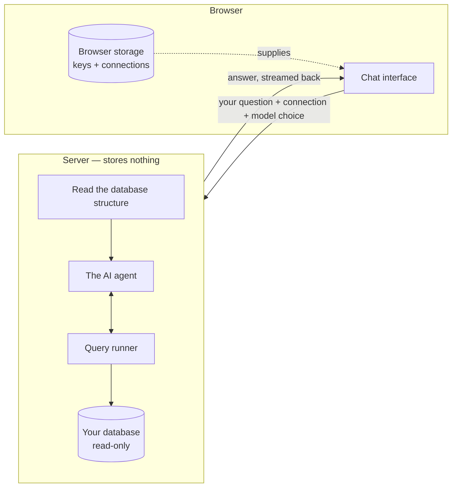
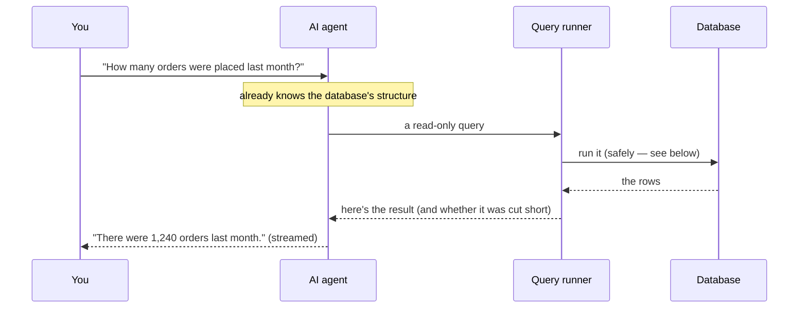

# Building Sqliqs: notes from shipping V1

I just finished V1 of Sqliqs, and I want to write down how it really went before I forget. Not the tidy changelog version — the actual one. What the idea was, where I got stuck, what I tried, and what I'd tell myself if I were starting over.

## The idea

Here's the thought that started it. We talk to ChatGPT and Gemini all day. We let them search the web. And "chat with your documents" became a normal thing to do. If you step back, the pattern is pretty clear: a language model can work with anything you can hand it as text. That's basically the whole trick.

So why not a database? A database is text too, when you think about it — the schema is text, the queries are text, and the rows that come back are text. There's nothing about a database that a language model can't handle. 

And once you see that, the rest falls into place. A model is genuinely good at *writing* a query — give it the schema and a question and it'll hand you the SQL. The part that was always missing was *running* it. That's what tools are for: you let the model run its own query, you feed the result back, and now it isn't guessing anymore — it's looking at real data and answering from it. That one step is what turns a chatbot into something that actually does things.

That's all Sqliqs is, at its core: let the model see what's in your database, run queries against it, and give you back a plain-English answer that's actually based on the rows it pulled.

And one early decision — keep everything local, let people bring their own key — ended up shaping almost everything that came after.

## The main idea: keep the data with the user

The whole design came out of one rule: *the server keeps nothing.* Your connection strings, your keys, your chat history, your projects — all of it stays in your browser. When you ask a question, the connection string and key travel along with that one request, the server uses them to run a single read-only query and call your model, and then it forgets all of it.

This is a really nice thing to be able to promise. "We can't leak your database password because we never have it" is a much stronger thing to say than "we promise to look after it." But it also meant I had to drop a lot of habits. No user table. No server-side sessions. No "I'll just cache that for now." Every time I wanted to save something, I had to ask whether it could live in the browser instead.

To keep the querying manageable across Postgres, MySQL, SQLite, and Mongo, I leaned on two small pieces that ended up holding the whole thing together:

- One database interface (`getSchema`, `runQuery`) with a small factory that picks the right engine. The rest of the app has no idea which database it's actually talking to.
- One function that turns "the user picked Claude with this key" into a ready-to-use model. The rest of the code doesn't know or care who the provider is.

Now adding a new database or a new AI provider is basically one new file and one new `case`. I didn't plan it that way — it just happened, because I kept running into the same kind of problem and got tired of handling each one separately.

## How it works, end to end

The most important call was where things live. Anything sensitive — your database details and your AI key — stays in *your browser*. When you ask something, those details go along with that one request, the server uses them once, and then they're gone. Nothing about your database is ever saved on my end.

The server's job is small on purpose: read the database structure, hand that plus your question to the agent, and stream the answer back. It passes things through — it doesn't keep them.

## The agent loop

Here's what actually happens when you ask one question. The model gets a description of your database first, so it knows what tables and columns are there. Then it gets a few turns of "ask the database something, look at what comes back, decide what to do next" before it has to answer you.

Two small things about that query runner made a real difference:

- **It works with every database, not just SQL.** The model hands over "a query," and the part that knows about Postgres vs. MongoDB figures out how to actually run it. The agent never has to think about which database it's on — which is why one design can cover four of them.
- **It owns up when it didn't get everything.** Results are capped at a sensible size, and if it hits that cap, the runner tells the model "this got cut off." That pushes the model to ask for a summary — a count, an average — instead of confidently drawing conclusions from half a list.

## Challenge 1: making "read-only" actually mean read-only

The scariest part of letting a model write queries against a real database is the obvious one: what if it writes a `DELETE`? Or what if someone pastes in a message designed to trick it into doing that?

My first move was to check the generated SQL — block anything with `INSERT`, `UPDATE`, `DROP`, and so on. That's worth doing, but it's not enough, and it's easy to get wrong. A lazy keyword check will happily reject a perfectly fine query against a column called `updated_at`, or get fooled by something like `SELECT ...; DELETE ...` stuck together.

So the check ended up more careful than I expected — match the dangerous words as whole words, strip out comments first, allow only one statement at a time — and, more importantly, I stopped treating it as the only thing standing in the way. The real protection is running everything in the database's own read-only mode, capping how many rows come back, and putting a timeout on every query. The keyword check is the polite first "no"; the database's read-only mode is the one that actually holds the line.

This next bit was my best decision: feeding hundreds of raw rows into the model just makes it make things up. Forcing the agent to `COUNT` first and only pull a few rows when it really needs them made the answers *better*, not just safer.

## Challenge 2: I added login, then ripped it all out

For a while the app had Clerk in it — sign in, sign up, the whole thing. It felt like the responsible choice. Then I actually asked myself what the login was protecting, and the answer was nothing. Literally nothing. There's no data on the server to guard. Your projects and keys live in your browser whether you're "logged in" or not. The login screen was just extra weight. I really believe this now: keep only what's useful. If something makes sense on paper but isn't actually doing a job, it should go. The fewer moving parts, the easier the whole thing is to understand.

The only real jobs login was doing were knowing who did what, and rate-limiting the shared free key — and neither of those needs accounts. So I pulled all of it. It was surprisingly hard to do. You build up this belief that a "real" app needs login, and deleting it feels like you're forgetting something important. But the product got cleaner and the privacy story got more honest the second it was gone. Good lesson: don't add something because it's expected, add it because it's pulling its weight.

It did leave one sharp edge I try to be honest about: the API routes are now open to anyone. For a hosted version that means I need proper rate limiting and SSRF protection (you can't let a stranger point a connection string at some internal address) before I open it up wide. Removing login didn't make those problems go away — it just moved them somewhere I have to deal with on purpose.

## Challenge 3: the bug that taught me to read the library

This one stung, but in a good way. In the public playground, you'd type a question, hit send, and… the box would just empty out. Nothing else. No message, no error, no answer. But the exact same chat component worked perfectly inside a project. Same code. Same everything.

I wasted a while blaming the server, the free key running out, a layout problem — anything. It was none of that. The server was streaming back fine when I hit it directly. The bug was a tiny detail in how I was calling `useChat` (from AI-SDK/React).

Inside a project, I pass a real session id. In the playground there's no session, so I was passing `id: undefined`. Looks harmless. But the key `id` was still *there* in the options, and when the chat library gets `undefined`, it makes up its own real id internally. Then its "should I rebuild this chat?" check compares that real id against my `undefined`, decides they don't match, and rebuilds the whole chat on every single render. So my message would send, the next render would throw everything away, and I'd be staring at an empty box.

The fix was to just not include the key at all when there's no id. Two lines. The lesson I keep having to relearn: when a library does something that seems impossible, the impossible part is almost always something I assumed about how it works — and the fastest way out is to stop guessing and go read its code.

## The small stuff that ate real time

A few things were humbling exactly because they sounded so simple:

- **Naming.** I built most of this calling it "Talkql," got attached to the name, and then found out it was already taken — by more than one similar project. Cue an afternoon of bad name ideas before I landed on Sqliqs (and grabbed the domain right away this time).
- **The logo.** The mark was a thin teal line that basically disappeared on a dark background. Looked fine in the design, vanished as a favicon. I ended up recoloring it to the brand gradient and writing a little script to generate the whole icon set from one SVG, so I'd never resize a favicon by hand again.
- **Exporting an ER diagram** that didn't get cut off at the edges turned into a fiddly fight with viewport math. The kind of thing that's "almost done" for way longer than it has any right to be.

None of these are interesting features. But all of them are the difference between a demo and something that feels finished.

## The outcome

V1 does what I wanted. You can connect Postgres, MySQL, SQLite, or Mongo, ask questions in plain English, and get back answers, charts, full reports, and an ER diagram — without an account, with your own key (or a free one), and with your credentials never leaving your browser. There's a public playground so people can try it in about ten seconds, it's an installable app, and the SEO and social cards are in place. It's open source under MIT now, and the code is set up so that "add another database" or "add another model" is a genuinely small change.

It's not totally done — the public endpoints need hardening before I'd call a hosted version production-ready, and there's a list of engines and features I still want. But it's a real V1, and it's out.

## What I'm taking with me

- **Pick a constraint and let it make the decisions.** "The server stores nothing" answered a hundred smaller questions for me without any back-and-forth.
- **Layers beat one clever check.** The read-only keyword check is fine; the database's read-only mode is the part I actually trust.
- **Delete the thing that isn't earning its keep.** Login felt necessary right up until I asked what it was protecting.
- **When a dependency seems broken, read it.** My worst bug was hiding in an assumption, and the answer was sitting in the source the whole time.
- **The last 10% is mostly small, unglamorous, fiddly work** — names, icons, edge-of-the-canvas exports — and it's also most of what makes something feel real.

On to V2.
